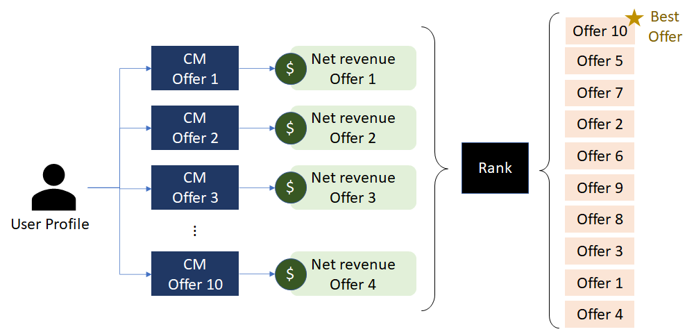

# Recommendation engine to boost Startbucks offers

This GitHub repository contains all piece of code used to analyse the Starbucks data to determine which demographic group responds best to which offer.  

To solve this data scientist problem, this repository contains a recommendation engine to determine the best offer to send to a client. Using machine learning algorithms and data visualisation strategies, the recommendation engine can determine the best offer based only on the offer the client profile - such as gender, age and income. 

Coded in Python and using Jupyter Notebook, the recommendation engine is based on a trained linear regression model to estimate the offer net revenue.

The key results and discussions of the developped recommendation engine is available in this [blog post](https://daniyamashita.medium.com/recommendation-engine-to-boost-startbucks-offers-70e12d0d2436).

## Installation and libraries

To run the recommendation engine, it is necessary to install Python 3.6.3, and Anaconda.

The complete data analysis and the developed recommendation engine are available in the Jupyter Notebook (.ipynb) named _Starbucks_Capstone_notebook_. The html version of this Jupyter is also available in this GitHub repository with the same name.

The libraries used in this project are:

- Numpy
- Pandas
- Matplotlib
- Json
- Seaborn
- Datetime
- Sklearn
- Pickle

## Data input

This project analyses the real Starbucks dataset provided by [Udacity](https://www.udacity.com/) that are also available in the folder `\Data`. The data input are structured into three as JSON files, namely:

- **Portfolio** — dataset describing the characteristics of each offer type, including its offer type, difficulty, and duration.

- **Profile** — dataset containing information regarding customer demographics including age, gender, income, and the date they created an account for Starbucks Rewards.

- **Transcript**** — dataset containing all the instances when a customer made a purchase. Moreover, it indicates when the client viewed, received, and completed an offer.

## Main results

The analysis implemented in this project resulted in the development of three different machine learning models based on linear regression to estimate the expected net revenue of each offer, as shown in the schematic below. 

By comparing the Mean Squared Error (MSE) of each of these three machine learning model, it could be concluded that the model that uses the whole client profile can assure the lowest MSE. Consequently, the designed recommendation engine uses this model to determine the best offer to send to a client.

By running the developped engine throughout the entire client portfolio, it could be noted that a discount offer with discount 2, difficulty 10, and duration 10 is to offer that is the most cost-effective. Therefore, this offer was ranked the best one for more than 80% of time. 

As improvement, it is necessary to verify the impact of the cost of investment on the net revenue and the final engine recommendation. Additionnaly, it is needed to verify if the money spent by the client during two consecutive offers has no influence in future purchases. Finally, the performance of the developped engine can be compared with a classifier, such as Random Forest, or support vector machines.

## Licensing, Authors, Acknowledgements, etc.

The data for analysis was provided by Udacity under the [Data Scientist Nanodegree program](https://www.udacity.com/blog/2018/05/introducing-udacity-data-scientist-nanodegree-program.html).